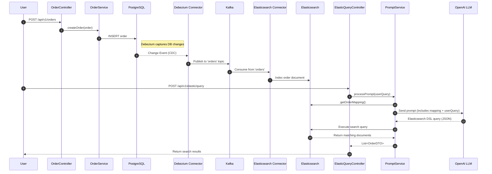

# Query Elasticsearch using Spring AI

This project demonstrates how to use Spring AI to convert natural language queries into Elasticsearch queries, with data flowing from PostgreSQL to Elasticsearch via Kafka Connect. Read the accompanying [blog](https://blog.arunbalachandran.com/natural-language-queries-on-postgres-using-cqrs-elasticsearch-and-spring-ai) for understanding the motivation for the project & detailed guidance.

## Quick Start

### Prerequisites
- Docker and Docker Compose
- Java 21
- OpenAI API Key
- Optional: NodeJS (if running the UI)

### Setup & Run

1. **Clone and Start Infrastructure**
   ```bash
   git clone <repository-url>
   cd querybackend
   docker-compose up -d postgres kafka zookeeper akhq elasticsearch kafka-connect
   ```

2. **Configure Environment**
   ```bash
   export OPENAI_API_KEY=your-api-key-here
   # or if using Intellij you can set it in your build configurations
   ```

3. **Initialize Elasticsearch (if you haven't already)**
   ```bash
   # Create the Order index with the required mapping:
   curl -X PUT "http://localhost:9200/order" \
   -H "Content-Type: application/json" \
   -d '{
       "mappings": {
           "properties": {
               "id": {
               "type": "keyword"
               },
               "product_name": {
               "type": "text",
               "fields": {
                   "keyword": {
                   "type": "keyword",
                   "ignore_above": 256
                   }
               }
               },
               "product_qty": {
               "type": "integer"
               },
               "product_price": {
               "type": "double"
               },
               "product_description": {
               "type": "text"
               },
               "created_time": {
               "type": "date"
               },
               "updated_time": {
               "type": "date"
               }
           }
       }
   }'

   # verify
   curl "http://localhost:9200/order/_mapping" -H "Content-Type: application/json"
   # returns mapping
   ```

4. **Start the Application**
   ```bash
   ./gradlew bootRun
   ```

## Data Flow Setup

### 1. Setup Kafka Connect
Initialize the PostgreSQL to Elasticsearch connectors:
```bash

# PostgreSQL to Kafka (Debezium)
curl -X POST http://localhost:8084/connectors -H "Content-Type: application/json" -d '{
    "name": "postgres-to-kafka-connector",
    "config": {
        "connector.class": "io.debezium.connector.postgresql.PostgresConnector",
        "database.hostname": "postgres",
        "database.port": "5432",
        "database.user": "postgres",
        "database.password": "password",
        "database.dbname" : "querybackend",
        "topic.prefix": "connector",
        "tasks.max": "1",
        "schemas.enable": "false",
        "schema.include.list": "public",
        "table.include.list": "public.orders",
        "signal.data.collection": "public.debezium_signal",
        "key.converter": "org.apache.kafka.connect.json.JsonConverter",
        "key.converter.schemas.enable": false,
        "value.converter": "org.apache.kafka.connect.json.JsonConverter",
        "value.converter.schemas.enable": false,
        "auto.register.schemas": true,
        "topic.creation.default.replication.factor": 1,
        "topic.creation.default.partitions": 1,
        "transforms": "extractlatest",
        "transforms.extractlatest.type": "org.apache.kafka.connect.transforms.ExtractField$Value",
        "transforms.extractlatest.field": "after",
        "time.precision.mode": "connect",
        "decimal.handling.mode": "double",
        "heartbeat.interval.ms": "1800000",
        "snapshot.mode": "initial",
        "plugin.name": "pgoutput",
        "slot.name" : "query_slot_orders_01"
    }
}'

# Kafka to Elasticsearch (Confluent Sink)
curl -X POST http://localhost:8084/connectors -H "Content-Type: application/json" -d '{
  "name": "elasticsearch-sink-connector",
  "config": {
    "connector.class": "io.confluent.connect.elasticsearch.ElasticsearchSinkConnector",
    "tasks.max": "1",
    "topics": "connector.public.orders",
    "schemas.enable": false,
    "schema.ignore": true,
    "key.converter": "org.apache.kafka.connect.json.JsonConverter",
    "key.converter.schemas.enable": false,    
    "value.converter": "org.apache.kafka.connect.json.JsonConverter",
    "value.converter.schemas.enable": false,
    "type.name": "_doc",
    "key.ignore": false,
    "index": "orders",
    "connection.url": "http://elasticsearch:9200",
    "transforms": "InsertKey,ExtractId",
    "transforms.InsertKey.type": "org.apache.kafka.connect.transforms.ValueToKey",
    "transforms.InsertKey.fields": "id",
    "transforms.ExtractId.type": "org.apache.kafka.connect.transforms.ExtractField$Key",
    "transforms.ExtractId.field": "id",
    "transforms.unwrap.drop.tombstones": "false",
    "transforms.unwrap.drop.deletes": "false",
    "behavior.on.null.values": "delete"
  }
}'
```

## Testing the Setup
Use the following commands to verify that the setup is working. I've also added a postman collection that can be used for convenience.

### 1. Create Test Data
Add an order using the REST API:
```bash
curl -X POST http://localhost:8080/api/v1/orders \
-H "Content-Type: application/json" \
-d '{
  "productName": "Test Product",
  "productQty": 1,
  "productPrice": 99.99,
  "productDescription": "A test product"
}'

# Response
{
    "id": "ebc44c8d-c5e6-4873-9baa-c94e2f2d8a48",
    "productName": "Test Product",
    "productQty": 1,
    "productPrice": 99.99,
    "productDescription": "A test product",
    "createdTime": "2025-05-15T21:35:00.299667",
    "updatedTime": "2025-05-15T21:35:00.29975"
}

curl 'http://localhost:8080/api/v1/orders'

# Response
[
    {
        "id": "ebc44c8d-c5e6-4873-9baa-c94e2f2d8a48",
        "productName": "Test Product",
        "productQty": 1,
        "productPrice": 99.99,
        "productDescription": "A test product",
        "createdTime": "2025-05-15T21:35:00.299667",
        "updatedTime": "2025-05-15T21:35:00.29975"
    }
]
```

### 2. Verify Data Flow
- Check PostgreSQL: Use DBeaver or your favorite database tool to connect to `localhost:5432` (user: postgres, password: password)
- Check Elasticsearch: Use Kibana at `http://localhost:5601` to view the data

### 3. Test Natural Language Queries
Try the natural language query API:
```bash
curl -X POST http://localhost:8080/api/v1/elastic/query \
-H "Content-Type: application/json" \
-d '"Show me all orders with price greater than 50"'
```

### 4. Optional: Running the UI
Following the commands given below to start the UI
```bash
cd queryui
# install dependencies if you haven't already
npm install
# run the application
npm run dev

# Note: Application starts on port 5173. Use the search bar to write natural language queries.
```

## Troubleshooting

- **Elasticsearch Issues**: Check status at `http://localhost:9200`
- **Kafka Connect**: Monitor at `http://localhost:8084`
- **Kafka UI**: Access AKHQ at `http://localhost:8081`
- **Reset Elasticsearch Index**:
  ```bash
  curl -X DELETE "http://localhost:9200/order"
  ```

## Additional Resources
- [Spring AI Documentation](https://docs.spring.io/spring-ai/reference/index.html)
- [Elasticsearch Documentation](https://www.elastic.co/guide/index.html)
- [Kafka Connect Documentation](https://docs.confluent.io/platform/current/connect/index.html)
- [Debezium Connector Reference](https://debezium.io/documentation/reference/stable/connectors/postgresql.html)
- [Elasticsearch Connector Reference](https://docs.confluent.io/kafka-connectors/elasticsearch/current/overview.html)

## Sequence Diagram
